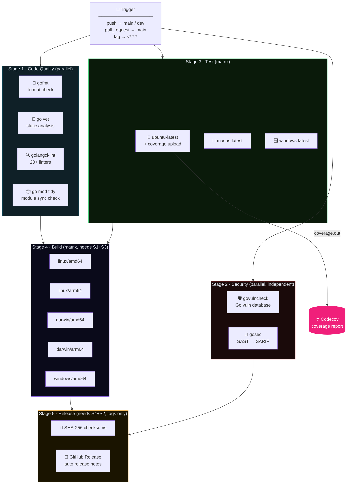
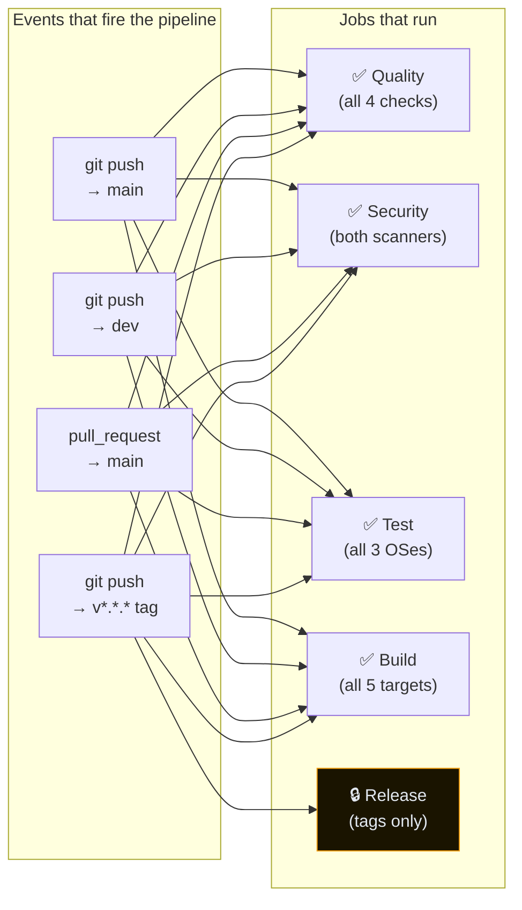
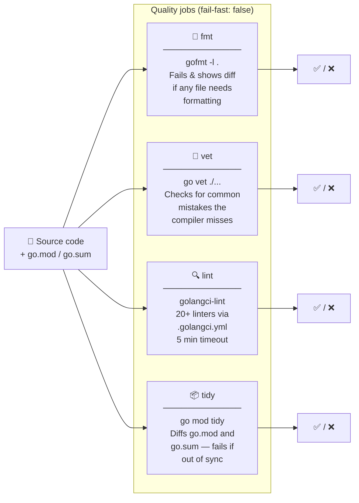
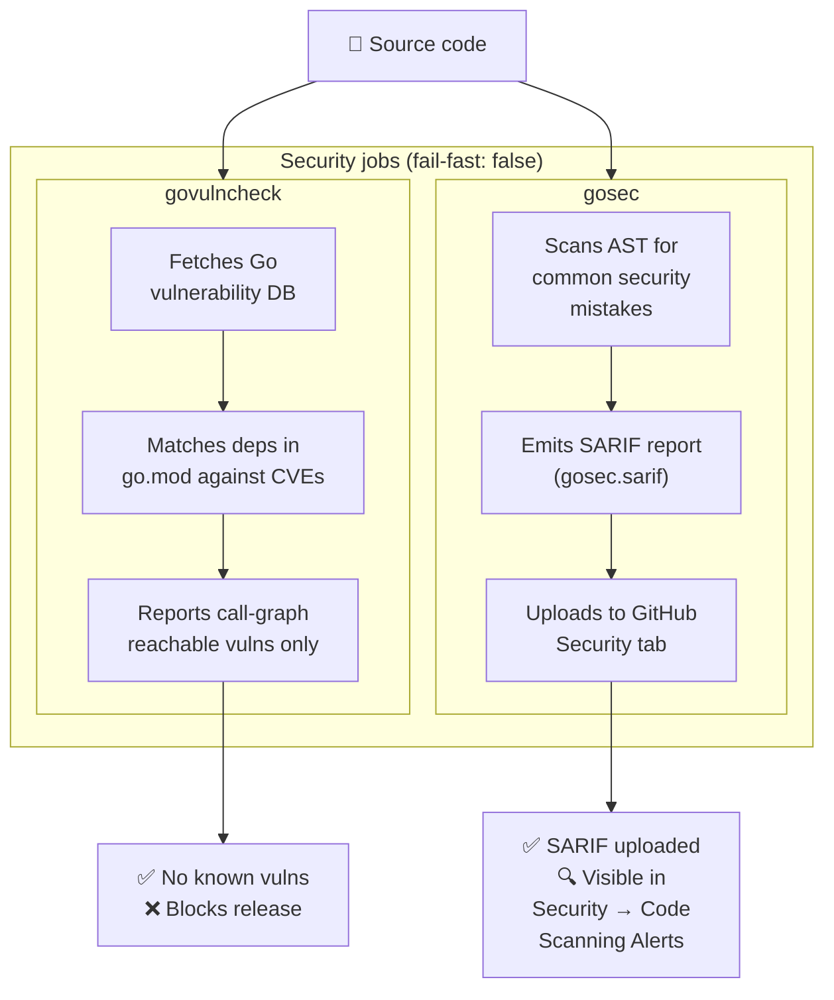
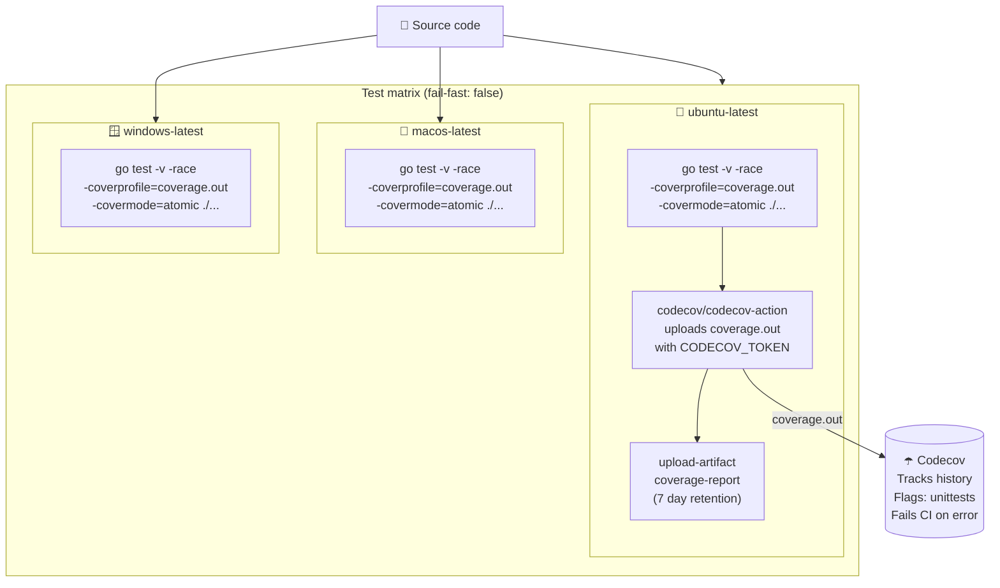
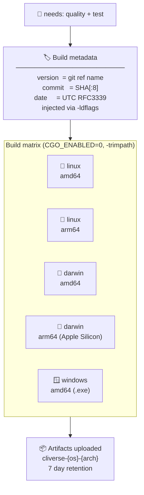
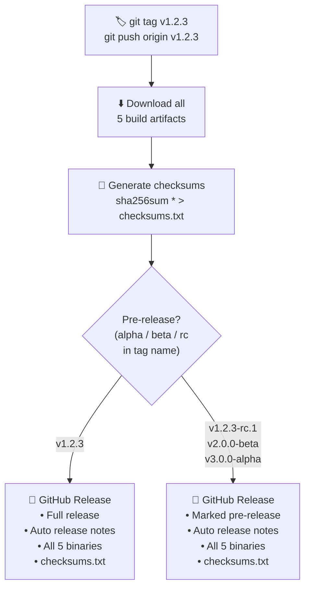
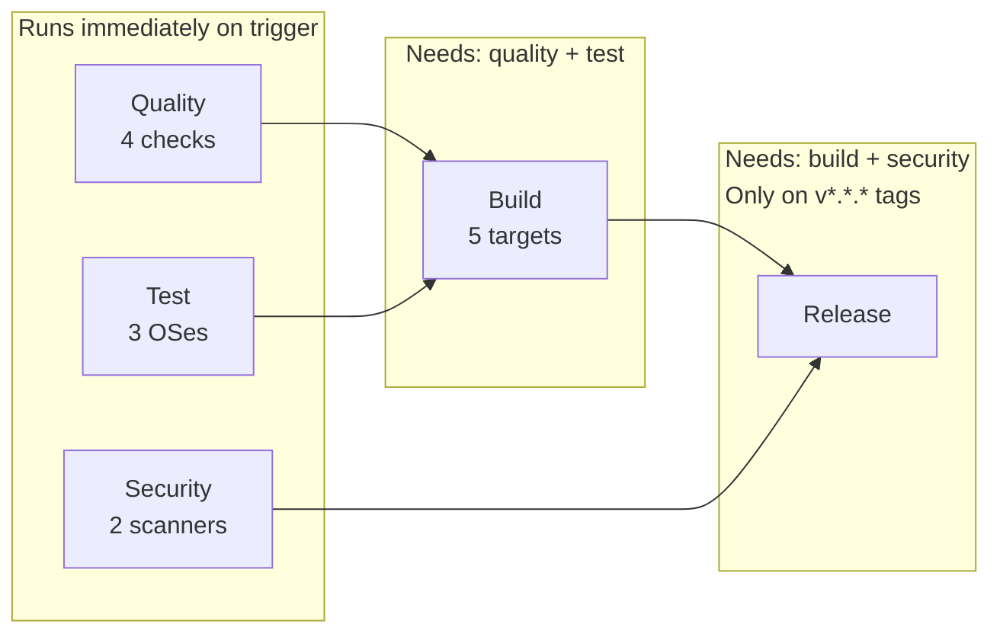

# CI/CD Pipeline

<div align="center">

[](https://github.com/ayush1452/CLIverse/actions/workflows/ci.yml)
[](https://codecov.io/gh/ayush1452/CLIverse)
[](https://golang.org)
[](https://github.com/ayush1452/CLIverse/security)
[](https://github.com/ayush1452/CLIverse/releases)
[](https://github.com/ayush1452/CLIverse/releases)

**Five-stage automated pipeline · Code quality → Security → Test → Build → Release**

</div>

---

## Pipeline at a Glance



---

## Trigger Conditions



> Concurrent runs on the same branch are cancelled automatically (except `main`, where all runs complete).

---

## Stage 1 · Code Quality

Four checks run in **parallel** — each is a separate job so a failure is pinpointed precisely.



**Linters enabled in `.golangci.yml`**

| Linter | What it catches |
|---|---|
| `errcheck` | Ignored errors |
| `staticcheck` | Bugs, performance, style |
| `gosimple` | Simplifiable code |
| `unused` | Dead code |
| `gofmt` / `goimports` | Formatting and import order |
| `misspell` | Typos in comments and strings |
| `bodyclose` | Unclosed HTTP response bodies |
| `prealloc` | Slice pre-allocation opportunities |
| `unconvert` | Unnecessary type conversions |
| `noctx` | HTTP requests missing context |

---

## Stage 2 · Security

Two scanners run **independently and in parallel** — a failure in either blocks the release stage.



> SARIF results appear in **GitHub → Security → Code Scanning Alerts** even when the job passes.

---

## Stage 3 · Test

Tests run across all three target operating systems **in parallel**, with race detection enabled.



**Flags used**

| Flag | Purpose |
|---|---|
| `-v` | Verbose output — every test name visible in the log |
| `-race` | Enables Go race detector — catches concurrent memory access bugs |
| `-covermode=atomic` | Thread-safe coverage counters (required with `-race`) |
| `-coverprofile` | Writes coverage data consumed by Codecov |

---

## Stage 4 · Build

Cross-compilation of **five release targets**, gated on Stage 1 and Stage 3 both passing.



**ldflags injected into every binary**

```
-s -w                              strip debug symbols + DWARF → smaller binary
-trimpath                          remove build machine paths from stack traces
-X main.version=<tag or branch>   embedded version string
-X main.commit=<sha[:8]>          short commit hash
-X main.date=<UTC RFC3339>        build timestamp
```

> To expose these in the CLI, add `var version, commit, date string` to [main.go](main.go).

---

## Stage 5 · Release

Runs **only on `v*.*.*` tags**, requires both the Build and Security stages to pass.



**Published release assets**

```
cliverse-linux-amd64
cliverse-linux-arm64
cliverse-darwin-amd64
cliverse-darwin-arm64
cliverse-windows-amd64.exe
checksums.txt
```

---

## Job Dependency Graph



---

## Configuration

### Required secret

| Secret | Where to set | Description |
|---|---|---|
| `CODECOV_TOKEN` | Repository → Settings → Secrets and Variables → Actions | Codecov upload token from [codecov.io](https://codecov.io) |

### Required GitHub permissions

The Release job uses `permissions: contents: write` to create GitHub Releases. This is scoped to the job only — all other jobs run with default read permissions.

No additional repository settings are needed beyond the Codecov token.

---

## How to Ship a Release

```bash
# Stable release
git tag v1.0.0
git push origin v1.0.0

# Release candidate (marked pre-release automatically)
git tag v1.0.0-rc.1
git push origin v1.0.0-rc.1

# Beta (marked pre-release automatically)
git tag v2.0.0-beta
git push origin v2.0.0-beta
```

The pipeline will:

1. Run all Quality and Security checks
2. Test across Linux, macOS, Windows
3. Compile all 5 binaries with version metadata embedded
4. Publish a GitHub Release with checksums

---

## Local Equivalents

Every pipeline step has a local `make` counterpart.

| Pipeline stage | Local command |
|---|---|
| Format check | `make fmt` then `git diff` |
| Static analysis | `go vet ./...` |
| Lint | `make lint` |
| Module tidy | `go mod tidy && git diff go.mod go.sum` |
| Vulnerability scan | `make vuln` |
| Tests | `make test` |
| Coverage report | `make coverage` → opens `coverage.html` |
| Build | `make build` |

---

## Pipeline Files

```text
CLIverse/
├── .github/
│   └── workflows/
│       └── ci.yml          ← full pipeline definition
├── .golangci.yml           ← linter configuration
└── CI_CD.md                ← this document
```

---

<div align="center">

Built for [CLIverse](README.md) · Powered by [GitHub Actions](https://github.com/features/actions)

</div>
