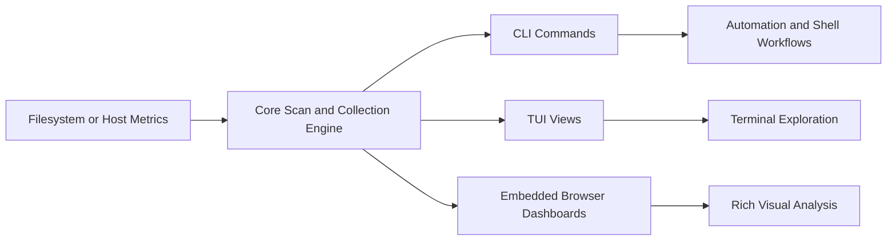
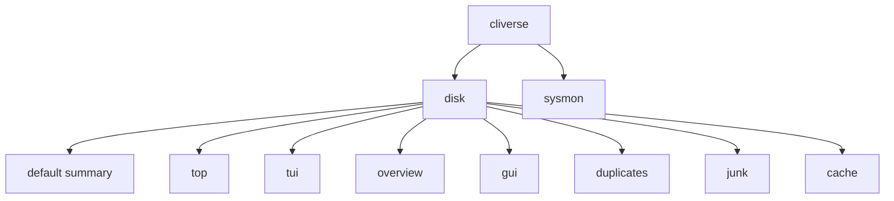
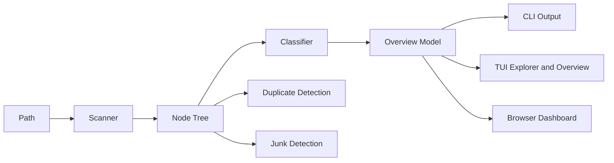
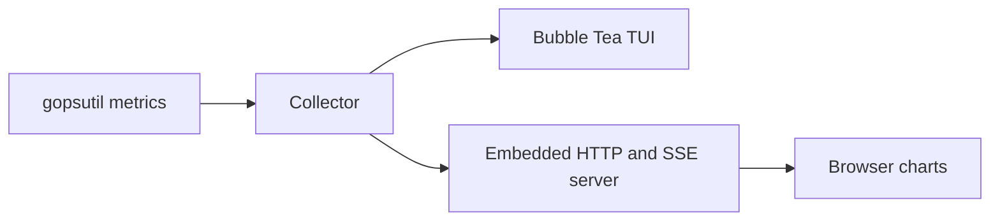
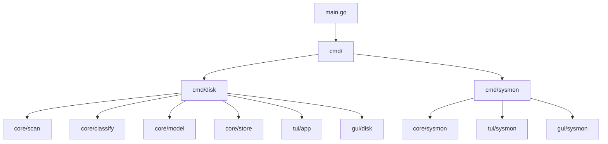

# CLIverse

<div align="center">

**Terminal-native observability and disk intelligence for developers and power users**

[](https://golang.org)
[](#interfaces)
[](#installation)

</div>

CLIverse is a Go-based toolkit for exploring storage and monitoring system activity without leaving the terminal workflow.

It currently ships two primary tools:

- `disk` for filesystem scanning, disk analysis, duplicate detection, junk discovery, TUI exploration, and a browser dashboard
- `sysmon` for live CPU, memory, disk I/O, network, and process monitoring with an optional live GUI

## Why CLIverse

Most terminal tools are either fast but raw, or visual but shallow. CLIverse aims for the middle ground:

- scriptable CLI output when you need automation
- high-signal TUIs when you need interactive inspection
- browser dashboards when the data deserves more visual depth
- safe cleanup workflows instead of destructive defaults

## Interfaces

CLIverse is designed as one engine with multiple frontends.



## Feature Overview

| Tool | Interface | What it does |
| --- | --- | --- |
| `cliverse disk` | CLI | Fast scan summaries, top entries, JSON export, scripting output |
| `cliverse disk tui` | TUI | Interactive explorer with inspector and overview surfaces |
| `cliverse disk gui` | Browser GUI | Capacity breakdowns, category views, root composition, recent files, extension pressure |
| `cliverse disk duplicates` | CLI | Multi-stage duplicate detection with keep rules and optional destructive actions |
| `cliverse disk junk` | CLI | Safety-tiered junk detection for developer, system, and trash cleanup |
| `cliverse sysmon` | TUI | Real-time system monitor for CPU, memory, disk I/O, network, and processes |
| `sysmon` live GUI | Browser GUI | Live charts via the system monitor TUI using the `v` key |

## Quick Start

### Build locally

```bash
git clone https://github.com/ayush1452/CLIverse
cd CLIverse
make build
./cliverse --help
```

### Install directly

```bash
go install github.com/ayush1452/CLIverse@latest
cliverse --help
```

### First commands to try

```bash
# Scan the current directory
cliverse disk .

# Open the disk explorer TUI
cliverse disk tui .

# Open the disk dashboard in a browser
cliverse disk gui .

# Find large duplicate candidates
cliverse disk duplicates . --min-size 10M

# Find developer junk
cliverse disk junk . --profile dev

# Start the live system monitor
cliverse sysmon
```

## Command Map



## Disk Tool

### What it is

`cliverse disk` is the storage-analysis side of the project. It scans a path, builds a recursive node model, classifies content, and exposes the same underlying data through CLI, TUI, JSON, and browser surfaces.

### Core capabilities

- fast parallel directory scanning
- allocated vs apparent size views
- category classification for common storage types
- top-N directory and file analysis
- duplicate detection using size and hash stages
- junk detection with safety levels
- import and export of scan files
- terminal and browser-based exploration

### Typical workflows

#### 1. Quick disk summary

```bash
cliverse disk .
cliverse disk /var --top 20
cliverse disk . --json
```

Use this when you want a fast, scriptable answer about where space is going.

#### 2. Interactive terminal exploration

```bash
cliverse disk tui .
cliverse disk overview .
```

Use this when you want a terminal-first workflow with keyboard navigation and an inspector panel.

#### 3. Visual dashboard

```bash
cliverse disk gui .
cliverse disk gui /Users/you/Downloads
cliverse disk gui --import scan.json.gz
```

Use this when you want a more visual report with:

- filesystem occupancy
- scan share of the mounted filesystem
- root-level space composition tiles
- category breakdowns
- largest files and directories
- recent file changes
- extension-based storage pressure

#### 4. Duplicate analysis

```bash
cliverse disk duplicates .
cliverse disk duplicates . --min-size 10M
cliverse disk duplicates . --keep newest
cliverse disk duplicates . --apply trash
```

Duplicate detection pipeline:

1. Group candidate files by size.
2. Compute partial hashes for candidate groups.
3. Compute full hashes for remaining matches.
4. Optionally verify byte-for-byte before action.

#### 5. Junk and cleanup analysis

```bash
cliverse disk junk .
cliverse disk junk . --profile dev
cliverse disk junk . --aggressive
cliverse disk junk . --apply trash
```

Safety levels:

- `SAFE`: regenerable artifacts such as build outputs
- `CAUTION`: usually safe, but worth reviewing first
- `DANGER`: potentially meaningful data, only clean deliberately

### Disk TUI keybindings

| Key | Action |
| --- | --- |
| `j` / `k` / `↑` / `↓` | Move the cursor |
| `Enter` / `l` | Expand or collapse a directory |
| `h` / `←` / `Backspace` | Collapse or move to parent |
| `g` / `G` | Jump to top or bottom |
| `x` | Mark or unmark a node |
| `a` | Toggle allocated vs apparent size |
| `Tab` | Switch between Explorer and Overview |
| `t` | Jump to Explorer |
| `o` | Jump to Overview |
| `?` | Open help |
| `q` | Quit |

### Disk data flow



## System Monitor

### What it is

`cliverse sysmon` is a live monitor for machine activity. It samples host metrics every second and renders them in a high-density TUI. From inside the TUI, you can also open the live browser dashboard.

### Metrics surfaced

- total CPU usage
- per-core CPU usage
- memory and swap pressure
- disk read and write throughput
- network receive and send throughput
- top processes by CPU or memory

### Run it

```bash
cliverse sysmon
```

### Sysmon controls

| Key | Action |
| --- | --- |
| `q` / `Ctrl+C` | Quit |
| `p` | Toggle process sort between CPU and memory |
| `j` / `k` / `↑` / `↓` | Move process cursor |
| `v` | Open or reopen the live browser GUI |

### Sysmon architecture



## Import, Export, and Scripting

CLIverse can be used interactively or as part of shell workflows.

### Export a scan

```bash
cliverse disk . --export scan.json.gz
```

### Re-open an exported scan

```bash
cliverse disk --import scan.json.gz
cliverse disk tui --import scan.json.gz
cliverse disk gui --import scan.json.gz
```

### Produce machine-readable output

```bash
cliverse disk . --json
cliverse disk . --format json
```

## Installation

### Requirements

- Go `1.25+` if building from source
- a modern terminal for the TUIs
- a local browser for the embedded dashboards

### Supported environments

The project is designed to be cross-platform through Go and `gopsutil`, though the experience is currently strongest on desktop environments where:

- the terminal supports full-screen TUI rendering
- local browser opening is available
- filesystem metadata is accessible without excessive permission restrictions

## Development

### Common targets

```bash
make build
make test
make fmt
make lint
make run ARGS="disk gui ."
```

### Local architecture



### Repository layout

```text
CLIverse/
├── cmd/
│   ├── disk/          # Disk command tree and subcommands
│   └── sysmon/        # System monitor entrypoint
├── core/
│   ├── classify/      # Category classification logic
│   ├── model/         # Shared domain models
│   ├── scan/          # Filesystem scanner
│   ├── store/         # Scan import/export codecs
│   └── sysmon/        # System metric collection
├── gui/
│   ├── disk/          # Disk dashboard server and frontend
│   └── sysmon/        # System monitor server and frontend
├── tui/
│   ├── app/           # Disk TUI
│   ├── sysmon/        # System monitor TUI
│   ├── theme/         # Shared TUI theme definitions
│   └── widgets/       # Reusable text UI widgets
├── main.go
├── go.mod
└── Makefile
```

## Example Sessions

### Analyze a project directory

```bash
cliverse disk ~/code/my-project --top 25
cliverse disk gui ~/code/my-project
```

### Hunt large media files

```bash
cliverse disk top ~/Downloads --files -t 30
```

### Clean developer junk

```bash
cliverse disk junk ~/code --profile dev
```

### Look for reclaimable duplicate space

```bash
cliverse disk duplicates ~/Downloads --min-size 100M
```

### Watch system load live

```bash
cliverse sysmon
```

Then press `v` inside the TUI to open the live GUI dashboard.

## Roadmap

### Current

- Disk CLI summary, top, duplicate, junk, TUI, and browser dashboard
- System monitor TUI and live browser dashboard
- Scan import and export support
- Category-aware overview generation

### Planned

- scan diff mode
- command palette for TUI flows
- richer duplicate and junk TUI screens
- stronger cleanup recommendation workflows
- scaling improvements for very large trees

## Notes

- The browser dashboards are served locally by the CLI itself.
- Duplicate and junk commands support destructive actions; review the output carefully before using `--apply delete`.
- The repository does not currently include a license file, so distribution terms are not yet declared.

## Credits

Inspired by:

- [ncdu](https://dev.yorhel.nl/ncdu)
- [gdu](https://github.com/dundee/gdu)
- [dua-cli](https://github.com/Byron/dua-cli)
- [dust](https://github.com/bootandy/dust)

Built with:

- [Cobra](https://github.com/spf13/cobra)
- [Bubble Tea](https://github.com/charmbracelet/bubbletea)
- [Lipgloss](https://github.com/charmbracelet/lipgloss)
- [gopsutil](https://github.com/shirou/gopsutil)
